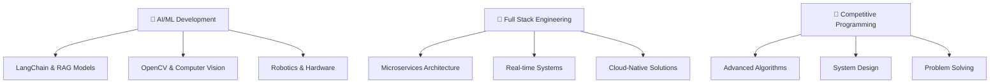

# 👋 Hi there, I'm **Imran Farooq**

<div align="center">

[](https://git.io/typing-svg)

</div>

---

## 🎯 **About Me**

```typescript
const imran = {
    role: "Full Stack Engineer",
    passions: ["AI/ML", "Robotics", "Competitive Programming"],
    currentFocus: "Building AGI-powered applications",
    lifeGoal: "Creating autonomous systems that change the world",
    funFact: "350+ LeetCode problems solved and counting! 🚀"
};
```

🔭 **Currently Working On:** AI-powered web applications using LangChain & RAG models  
🌱 **Learning:** Advanced Computer Vision, Robotics, and AGI development  
⚡ **Goal:** Contributing to autonomous driving systems and AI hardware  
🎲 **Fun Fact:** I solve algorithmic puzzles for breakfast and build robots for dinner!

---

## 🛠️ **Tech Arsenal**

<details>
<summary>💻 <strong>Frontend Development</strong></summary>

```
React.js ████████████████████████████████ 95%
Next.js  ████████████████████████████████ 90%
React Native ████████████████████████████ 90%
TypeScript ██████████████████████████████ 85%
Tailwind CSS ████████████████████████████ 80%
```

</details>

<details>
<summary>⚙️ <strong>Backend Engineering</strong></summary>

```
Node.js     ████████████████████████████████ 95%
NestJS      ████████████████████████████████ 85%
Express.js  ████████████████████████████████ 90%
GraphQL     ████████████████████████████████ 75%
Microservices ██████████████████████████████ 80%
```

</details>

<details>
<summary>🗄️ <strong>Database & Cloud</strong></summary>

```
PostgreSQL ████████████████████████████████ 90%
MongoDB    ████████████████████████████████ 85%
Redis      ████████████████████████████████ 70%
AWS        ████████████████████████████████ 80%
Docker     ████████████████████████████████ 75%
```

</details>

<details>
<summary>🤖 <strong>AI/ML & Advanced Tech</strong></summary>

```
LangChain   ████████████████████████████████ 75%
OpenCV      ████████████████████████████████ 60%
RAG Models  ████████████████████████████████ 70%
Python      ████████████████████████████████ 80%
C++         ████████████████████████████████ 85%
```

</details>

---

## 🚀 **Featured Projects**

<table>
<tr>
<td width="50%">

### 🤖 AI-Powered Chat Application
**Tech:** React, Node.js, LangChain, OpenAI  
A sophisticated chatbot with RAG implementation for contextual conversations.

**Features:**
- 📚 Knowledge base integration
- 🧠 Memory-based conversations  
- ⚡ Real-time responses

</td>
<td width="50%">

### 📱 Cross-Platform Mobile App
**Tech:** React Native, TypeScript, Firebase  
A feature-rich mobile application with offline capabilities.

**Features:**
- 🔄 Offline-first architecture
- 📊 Real-time analytics
- 🔐 Advanced authentication

</td>
</tr>
<tr>
<td width="50%">

### 🏗️ Microservices Architecture
**Tech:** NestJS, PostgreSQL, Kafka, Docker  
Scalable backend system handling millions of requests.

**Features:**
- ⚡ Event-driven design
- 📈 Auto-scaling capabilities
- 🛡️ Circuit breaker patterns

</td>
<td width="50%">

### 🧮 Algorithm Visualizer
**Tech:** React, D3.js, C++  
Interactive platform for learning data structures.

**Features:**
- 🎨 Visual algorithm execution
- 📊 Performance comparisons
- 🎯 Educational content

</td>
</tr>
</table>

---

## 📊 **GitHub Analytics**

<div align="center">
  
  
</div>

<div align="center">
  
</div>

### 🏆 **GitHub Trophies**
<div align="center">
  
</div>

---

## 🎯 **Competitive Programming**

<div align="center">

| Platform | Problems Solved | Rating | Badge |
|----------|----------------|--------|-------|
| **LeetCode** | 350+ | 1650+ |  |
| **CodeChef** | 200+ | 4⭐ |  |
| **Codeforces** | 150+ | Expert |  |

</div>

**Favorite Topics:** Dynamic Programming, Graph Algorithms, Tree Traversals, Greedy Algorithms

---

## 🌟 **Current Focus Areas**



---

## 📈 **Learning Journey**

- 🎓 **Currently Studying:** Advanced Machine Learning, Autonomous Systems
- 📚 **Reading:** "Artificial Intelligence: A Modern Approach" by Stuart Russell
- 🔬 **Experimenting:** Building AI agents with multi-modal capabilities
- 🎯 **Next Goal:** Contributing to open-source robotics projects

---

## 💼 **Professional Highlights**

✨ **5+ years** of full-stack development experience  
✨ **50+ projects** delivered across web and mobile platforms  
✨ **350+ algorithmic problems** solved with optimal solutions  
✨ **Microservices expert** with event-driven architecture experience  
✨ **AI/ML practitioner** building production-ready applications  

---

## 🤝 **Let's Connect & Collaborate**

<div align="center">

[](https://www.linkedin.com/in/imranfarooqqaisrani)
[](mailto:imranf620@gmail.com)
[](https://github.com/imranf620)
[](https://leetcode.com/imranf620)

</div>

---

<div align="center">

### 💭 **Philosophy**

*"The future belongs to those who combine human creativity with artificial intelligence."*

**🌟 Always open to exciting opportunities and collaborations! 🌟**


</div>

---

<div align="center">
  
</div>
